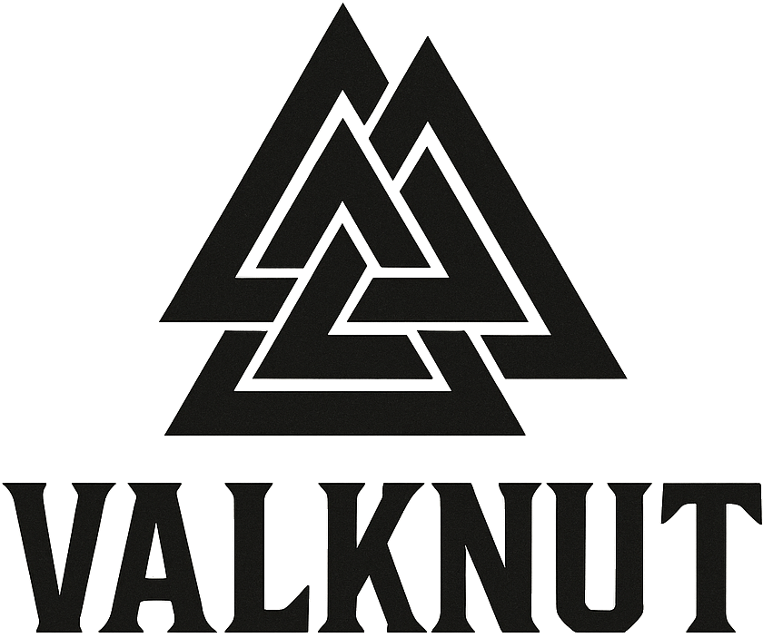

<div align="center">
  

  
  **AI-Powered Code Analysis & Refactoring Assistant**
</div>

Valknut is a comprehensive code analysis tool that combines structural analysis, complexity metrics, semantic naming evaluation, and technical debt assessment. Built in Rust for maximum performance, it provides actionable insights for improving code maintainability, identifying refactoring opportunities, and maintaining code quality through CI/CD pipeline integration.

[](https://www.rust-lang.org/)
[](https://opensource.org/licenses/MIT)

## Quick Start

### Installation

#### Via Homebrew (macOS)

```bash
brew tap sibyllinesoft/valknut
brew install valknut
```

#### Build from Source (requires Rust 1.70+)

```bash
git clone https://github.com/sibyllinesoft/valknut
cd valknut
cargo build --release
```

The binary will be available at `target/release/valknut`.

### Basic Usage

```bash
# Comprehensive analysis of current directory
valknut analyze .

# Generate HTML report for teams
valknut analyze --format html --out reports/ ./src

# Run with quality gates for CI/CD
valknut analyze --quality-gate --max-complexity 75 --min-health 60 ./src

# Use custom configuration
valknut analyze --config custom-config.yml ./src

# List supported programming languages  
valknut list-languages

# Create default configuration file
valknut init-config --output my-config.yml
```

### Configuration

Valknut uses YAML configuration files for comprehensive customization:

```bash
# Create a default configuration file
valknut init-config

# Validate your configuration
valknut validate-config --config .valknut.yml

# View default configuration
valknut print-default-config
```

## Features

### 🔍 Comprehensive Analysis Engine
- **Structure Analysis**: Directory organization, file distribution, and architectural patterns
- **Complexity Metrics**: Cyclomatic, cognitive complexity, and maintainability indices 
- **Semantic Naming**: AI-powered function and variable name quality assessment
- **Technical Debt**: Quantitative technical debt scoring and prioritization
- **Refactoring Opportunities**: Actionable recommendations with impact analysis
- **Dependencies & Impact**: Cycle detection, chokepoint analysis, and clone detection

### 🚀 CI/CD Integration & Quality Gates
- **Quality Gate Mode**: Fail builds when quality thresholds are exceeded
- **Configurable Thresholds**: Set limits for complexity, health scores, and issue counts
- **Multiple Report Formats**: JSON, HTML, Markdown, CSV, SonarQube integration
- **Team Reports**: Interactive HTML reports for code review and planning

### 🛠️ Developer Experience
- **⚡ High Performance**: Rust implementation with SIMD optimization
- **🔧 Extensive Configuration**: YAML-based configuration with validation
- **📊 Rich CLI Output**: Progress bars, colored output, and detailed summaries
- **🔤 Multi-language Support**: Python, TypeScript, JavaScript, Rust, Go, and more
- **📝 MCP Integration**: Claude Code integration for IDE assistance (in development)

## Architecture

### Multi-Stage Analysis Pipeline

Valknut employs a comprehensive, multi-stage analysis pipeline:

1. **File Discovery**: Intelligent traversal with configurable inclusion/exclusion patterns
2. **Structure Analysis**: Directory organization and file distribution assessment
3. **Complexity Analysis**: AST-based complexity metrics using Tree-sitter parsers
4. **Semantic Analysis**: AI-powered naming quality evaluation using embedding models
5. **Refactoring Analysis**: Identification of improvement opportunities with impact scoring
6. **Dependency Analysis**: Cycle detection, chokepoint identification, and clone analysis
7. **Health Metrics**: Overall codebase health scoring and quality assessment

### Analysis Capabilities

| Analysis Type | Description | Output |
|---------------|-------------|---------|
| **Structure** | Directory/file organization | Reorganization recommendations |
| **Complexity** | Cyclomatic/cognitive complexity | Complexity hotspots and refactoring targets |
| **Semantic Naming** | Function/variable name quality | Renaming suggestions with context |
| **Technical Debt** | Quantitative debt assessment | Prioritized debt reduction roadmap |
| **Dependencies** | Module relationships | Cycle breaking and decoupling suggestions |
| **Code Clones** | Duplicate code detection | Consolidation opportunities |

### Quality Gate Configuration

Integrate with CI/CD pipelines using configurable quality gates:

```yaml
quality_gates:
  enabled: true
  max_complexity: 75        # Maximum complexity score (0-100)
  min_health: 60           # Minimum health score (0-100) 
  max_debt: 30             # Maximum technical debt ratio (0-100)
  max_issues: 50           # Maximum total issues allowed
  max_critical: 0          # Maximum critical issues (0 = none allowed)
```

## Why Valknut?

### 🔥 Key Benefits

**🧠 AI-Powered Intelligence**: Leverages semantic analysis and machine learning for deeper code understanding beyond traditional static analysis.

**⚡ Rust Performance**: Built for speed with SIMD optimizations, parallel processing, and efficient memory usage.

**🏗️ Holistic Analysis**: Goes beyond syntax checking to analyze structure, complexity, naming, and technical debt in a unified view.

**🚦 Quality Gate Integration**: Purpose-built for CI/CD with configurable quality gates and automated failure conditions.

**📊 Actionable Intelligence**: Provides prioritized, contextual recommendations with impact analysis and refactoring guidance.

**👥 Team-Friendly Reports**: Interactive HTML reports, team dashboards, and integration with popular code review tools.

**🔧 Enterprise Ready**: Extensive configuration, multiple output formats, and integration with existing development workflows.

## Configuration

### Comprehensive Configuration System

Valknut supports extensive configuration through YAML files. Create and customize your configuration:

```bash
# Create default configuration
valknut init-config --output my-config.yml

# Validate configuration
valknut validate-config --config my-config.yml
```

### Key Configuration Sections

#### Analysis Pipeline
```yaml
analysis:
  enable_structure_analysis: true
  enable_complexity_analysis: true  
  enable_refactoring_analysis: true
  enable_names_analysis: true       # AI semantic naming
  confidence_threshold: 0.7
  max_files: 1000                   # 0 = unlimited
```

#### Quality Gates (CI/CD Integration)
```yaml
quality_gates:
  enabled: true
  max_complexity: 75               # Complexity score limit (0-100)
  min_health: 60                   # Minimum health score (0-100)
  max_debt: 30                     # Max technical debt ratio (0-100)
  max_issues: 50                   # Maximum total issues
  max_critical: 0                  # Maximum critical issues
```

#### Semantic Naming (AI-Powered)
```yaml
names:
  enabled: true
  embedding_model: "Qwen/Qwen3-Embedding-0.6B-GGUF"
  min_mismatch: 0.65               # Mismatch threshold (0.0-1.0)
  min_impact: 3                    # Impact threshold
  protect_public_api: true         # Protect public APIs
```

#### Multi-Language Support
```yaml
languages:
  python:
    enabled: true
    file_extensions: [".py", ".pyi"]
    complexity_threshold: 10.0
  typescript:
    enabled: true
    file_extensions: [".ts", ".tsx"]
    complexity_threshold: 10.0
  rust:
    enabled: true
    file_extensions: [".rs"]
    complexity_threshold: 15.0
```

## CLI Commands

Valknut provides a rich CLI interface with multiple commands:

### Analysis Commands
```bash
# Comprehensive analysis
valknut analyze ./src --format html --out reports/

# Quality gate mode (fails with exit code 1 if thresholds exceeded)
valknut analyze --quality-gate --max-complexity 75 ./src

# Quick failure on any issues  
valknut analyze --fail-on-issues ./src

# Specific output formats
valknut analyze --format json ./src        # JSON output
valknut analyze --format markdown ./src    # Team report
valknut analyze --format csv ./src         # Spreadsheet data
valknut analyze --format sonar ./src       # SonarQube integration
```

### Configuration Management
```bash
# Create default config
valknut init-config --output my-config.yml

# Validate configuration
valknut validate-config --config my-config.yml

# View default configuration
valknut print-default-config
```

### Language Support
```bash
# List supported languages
valknut list-languages
```

### Legacy Commands (Backward Compatibility)
```bash
# Structure analysis only
valknut structure ./src --format pretty

# Impact analysis (dependency cycles, clones)
valknut impact ./src --cycles --clones
```

### IDE Integration
```bash
# MCP server for Claude Code (in development)
valknut mcp-stdio

# Generate MCP manifest
valknut mcp-manifest --output manifest.json
```

## Quality Gates & CI/CD Integration

### GitHub Actions Example
```yaml
name: Code Quality Gate
on: [push, pull_request]

jobs:
  quality-gate:
    runs-on: ubuntu-latest
    steps:
      - uses: actions/checkout@v3
      - name: Install Valknut
        run: |
          # Install via Homebrew
          brew tap sibyllinesoft/valknut
          brew install valknut
      
      - name: Run Quality Gate
        run: |
          valknut analyze \
            --quality-gate \
            --max-complexity 75 \
            --min-health 60 \
            --max-debt 30 \
            --format ci-summary \
            --out quality-reports/ \
            ./src
```

### Jenkins Pipeline
```groovy
pipeline {
    agent any
    stages {
        stage('Code Quality Gate') {
            steps {
                sh '''
                    valknut analyze \
                      --quality-gate \
                      --max-issues 50 \
                      --max-critical 0 \
                      --format sonar \
                      --out quality-reports/ \
                      ./src
                '''
            }
            post {
                always {
                    archiveArtifacts 'quality-reports/**/*'
                }
            }
        }
    }
}
```

## Performance & Scalability

- **🚀 High Performance**: Rust implementation with SIMD optimizations
- **📊 Parallel Processing**: Multi-threaded analysis with configurable concurrency
- **💾 Memory Efficient**: Streaming analysis with minimal memory footprint
- **⚡ Fast Analysis**: Optimized for large codebases (tested on 100k+ files)
- **🔄 Incremental Analysis**: Caching system for faster subsequent runs
- **📈 Scalable**: Linear performance scaling with codebase size

## Development & Contributing

### Development Setup

```bash
git clone https://github.com/sibyllinesoft/valknut
cd valknut

# Install dependencies and build
cargo build

# Install Tree-sitter parsers
./scripts/install_parsers.sh

# Run tests
cargo test

# Run benchmarks
cargo bench
```

### Project Structure
```
src/
├── bin/valknut.rs          # CLI binary entry point
├── core/                   # Core analysis pipeline
│   ├── pipeline.rs         # Main analysis orchestrator
│   ├── config.rs          # Configuration management
│   └── scoring.rs         # Scoring and metrics
├── detectors/             # Analysis modules
│   ├── complexity.rs      # Complexity analysis
│   ├── structure.rs       # Structure analysis
│   ├── refactoring.rs     # Refactoring recommendations
│   └── names/             # Semantic naming analysis
├── lang/                  # Language-specific parsers
│   ├── python.rs         # Python AST analysis
│   ├── typescript.rs     # TypeScript/JavaScript
│   └── rust_lang.rs      # Rust language support
└── io/                    # I/O and reporting
    ├── reports.rs         # Report generation
    └── cache.rs           # Caching system
```

### Contributing Guidelines

1. **Feature Development**
   - Create feature branch from `main`
   - Add comprehensive tests for new features
   - Update documentation
   - Ensure all CI checks pass

2. **Code Quality Standards**
   - Follow Rust best practices and idioms
   - Add documentation for public APIs
   - Maintain >90% test coverage
   - Run `cargo clippy` and `cargo fmt`

3. **Performance Requirements**
   - Benchmark new features with `cargo bench`
   - Profile memory usage for large inputs
   - Optimize critical paths with SIMD when applicable
   - Maintain linear or sub-linear complexity

### Testing Strategy

```bash
# Unit tests
cargo test --lib

# Integration tests
cargo test --test cli_tests

# Benchmark performance
cargo bench

# Test with real codebases
valknut analyze ./test_data/python_project --format json
```

## Output Formats & Reports

Valknut supports multiple output formats for different use cases:

### JSON/JSONL (Machine-readable)
```bash
valknut analyze --format json ./src       # Single JSON file
valknut analyze --format jsonl ./src      # Line-delimited JSON
valknut analyze --format ci-summary ./src # CI/CD optimized JSON
```

### HTML Reports (Interactive)
```bash
valknut analyze --format html --out reports/ ./src
```
Generates interactive HTML reports with:
- Visual complexity heatmaps
- Refactoring priority dashboards
- Code quality trends
- Technical debt visualization

### Team Reports (Markdown)
```bash
valknut analyze --format markdown ./src
```
Perfect for:
- Code review documentation
- Architecture decision records
- Team planning sessions
- Technical debt discussions

### Integration Formats
```bash
valknut analyze --format sonar ./src      # SonarQube integration
valknut analyze --format csv ./src        # Spreadsheet analysis
```

## Architecture Decision Records

See [docs/](docs/) for detailed architecture documentation:
- [Template System](docs/template-system.md) - Report generation architecture
- [Semantic Naming](docs/SEMANTIC_NAMING.md) - AI-powered naming analysis
- [Team Reports](docs/team_reports.md) - Collaborative analysis workflows

## License

This project is licensed under the MIT License - see the [LICENSE](LICENSE) file for details.

## Acknowledgments

- **Rust Ecosystem**: Built on excellent crates like Tree-sitter, Tokio, and Rayon
- **Research Foundation**: Based on latest research in code analysis and refactoring
- **AI Integration**: Leverages modern embedding models for semantic analysis
- **Community**: Thanks to contributors and users who help improve Valknut
- **Tree-sitter**: For robust, language-agnostic parsing capabilities